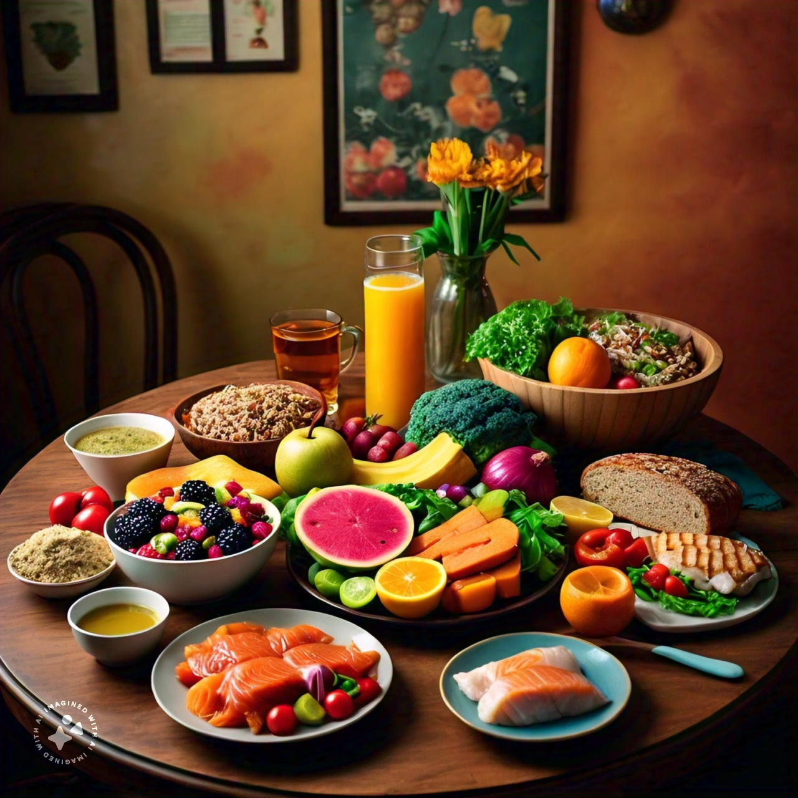

# Food Panel

[USDA Food Profiles](/data-commons/docs/food/) to integrate with [Nutritionix&nbsp;Label](/io/template/parser/)  
[USDA Food Data API](https://fdc.nal.usda.gov/api-guide.html)  
[Balanced Diet](/balance/) visualizations  
[Food Waste Methane Reuse](https://www.epa.gov/system/files/documents/2024-06/epa_usda_methane_and_food_waste_fact_sheet.pdf) - 1/3 of food goes uneaten

